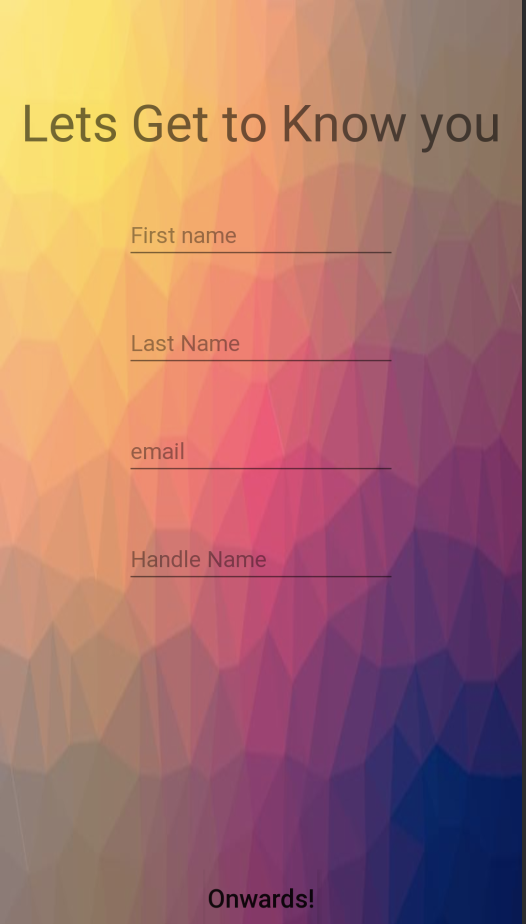
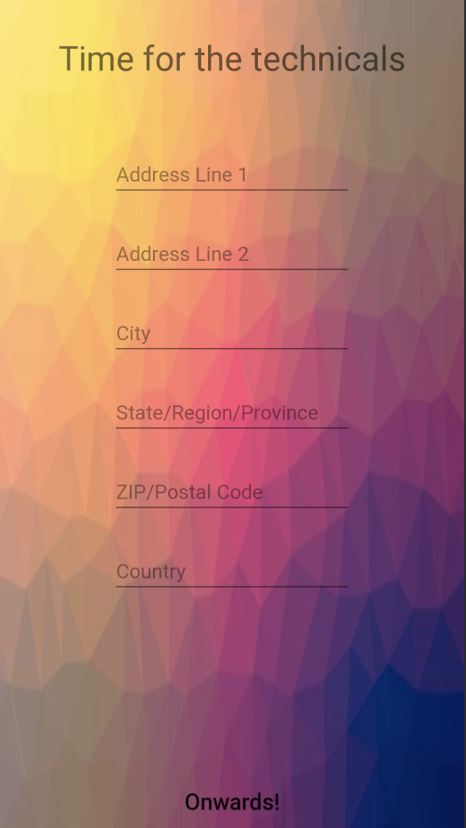

# UserResFlow
This is for the Tech LA Fellows. UserResFlow is the second prompt where a person is tasked with building some user signup flow.
In this version of the implementation I used Android Stduio and built an android app. Main language used was Java.
In this doc I will go over the basic implementation and things that could be improved upon if more time was used to devlop.

Again please note this is made in android studio, so If you would like this code for yourself please make sure to run the projet in Android Studio.

You can find the corresponding java files [here](https://github.com/MikeStoneColumbia/UserResFlow/tree/master/app/src/main/java/com/example/userresflow) and the res files [here](https://github.com/MikeStoneColumbia/UserResFlow/tree/master/app/src/main/res/layout).

# Splash Screen

A 4 second welcome screen just to make the user feel comfy. This will automatically take the person to the next activity screen
which prompts them to input their name, email, and some handle name.

# Name Email Handle Screen
Some EditTexts to get The name, email, and whatever handle name the user comes up with. Doesn't allow use to move onto the next
activity unless all fields are filled in, if user tries they will be greated with a Toast (screen notifcation) asking them to
fill in remainding info. Info is then taken via backend and processed so that it can be displayed in another screen.

# Adresss Screen
Similar concept from the Handle Screen, except this time we are collecting the user's address information. Same Toast behavior if a person doesn't
complete all fields. (They don't need to fill in the adress line 2 it is optional.)

# Display Screen
Displays to screen all user info that they inputed. It is meant to show off that we kept track of their data.

# Improvements

1. Decreasing the number of screens used. Not only would this reduce memory size but it would make passing and storing data more efficent
   1. One way to do this is to implement Fragments instead of activities. By manipulating the Fragment we could keep the manage the data in one activity and not need to pass it between activities
2. Have some Spinner options (drop down options) for things like country, state, and maybe language. This would reduce some of the potential error checking that you would need to do.
3. Somple UI improvement. Adding things like animations or small quality of life transitions to make the app more appealing to the eyes. Also removing the task bar at the top.
4. Screen compatability for different sized screens. Just like any application this is a big consideration.

